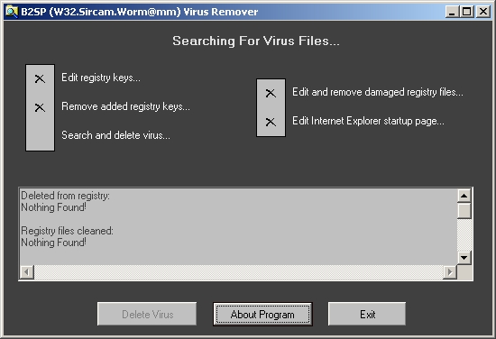



## W32\.Sircam\.Worm@mm Virus Remover \(UPDATED\!\!\!\)

### Description

(UPDATED!!!)

(I updated the program and now its all describted)

NOW! Please Vote For Me!

this code will remove the latest virus!!!:

(32.Sircam.Worm@mm)

this is my first try for a completed VB program and i am only 13 so please accept it :)

this code is working 100% :)

use the code as you like...if you have any improvments please send them to: b2sp@b2sp.net

Visit My Site @ http://security.b2sp.net
 
### More Info
 
remove the W32.Sircam.Worm@mm virus!!!

anti-virus

virus scan

anti-hackers

virus

hack

scan

virusscan

hacking

hacker

hackers

viruses

security

W32.sicam

worm@mm

remove

worm

vb

decleration

utility

control

system

virus system

internet

mobile

             |
---                |---
**Submitted On**   |2001-07-31 16:13:46
**By**             |[Zain\.A Tawfiq](https://github.com/Planet-Source-Code/PSCIndex/blob/master/ByAuthor/zain-a-tawfiq.md)
**Level**          |Beginner
**User Rating**    |3.0 (30 globes from 10 users)
**Compatibility**  |VB 6\.0
**Category**       |[Complete Applications](https://github.com/Planet-Source-Code/PSCIndex/blob/master/ByCategory/complete-applications__1-27.md)
**World**          |[Visual Basic](https://github.com/Planet-Source-Code/PSCIndex/blob/master/ByWorld/visual-basic.md)
**Archive File**   |[W32\_Sircam238057312001\.zip](https://github.com/Planet-Source-Code/zain-a-tawfiq-w32-sircam-worm-mm-virus-remover-updated__1-25671/archive/master.zip)

